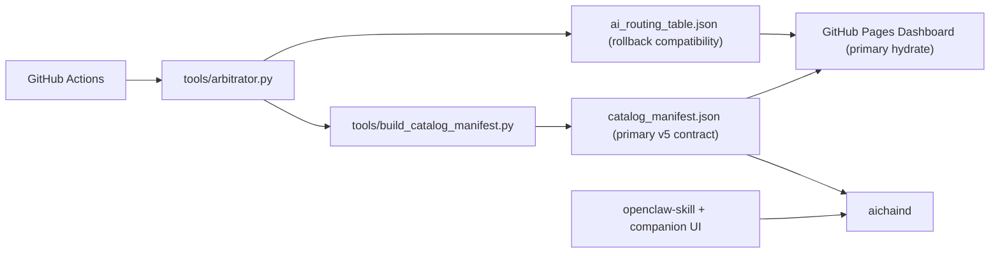

# ⛓ AIchain

<div align="center">

**Global catalog plane for AI routing. Local execution plane for OpenClaw.**

[](https://filokloi.github.io/AIchain/)
[](https://filokloi.github.io/AIchain/)
[](https://filokloi.github.io/AIchain/catalog_manifest.json)

**[Live Dashboard](https://filokloi.github.io/AIchain/)** · **[Catalog Manifest](https://filokloi.github.io/AIchain/catalog_manifest.json)** · **[v5 Technical Index](docs/V5_INDEX.md)** · **[Issues](https://github.com/filokloi/AIchain/issues)**

</div>

---

## Mission

AIchain is being refactored into a two-plane system:

- **Global plane**: the GitHub Pages site publishes the public catalog, routing hierarchy, compatibility contract, and operator-facing information.
- **Local plane**: the OpenClaw skill and `aichaind` sidecar execute requests locally, apply policy/privacy rules, choose providers, and stream results back safely.

The target outcome is simple:

**maximum intelligence, maximum speed, maximum stability, minimum cost**

---

## Current State

Today the repository publishes two feed formats:

- `catalog_manifest.json`
  - native v5 contract for `aichaind`
  - explicit roles for `fast`, `heavy`, and `visual`
  - plane metadata for global catalog vs local execution
- `ai_routing_table.json`
  - legacy ranking feed kept for compatibility
  - retained as a rollback/compatibility feed during burn-in

`aichaind` validates both formats and prefers the native v5 contract when available.
The GitHub Pages dashboard hydrates from `catalog_manifest.json` first and only falls back to the legacy feed if the canonical artifact is unavailable.
The local sidecar exposes `/health`, `/status`, provider access telemetry, session control state, and progress metadata for the OpenClaw bridge.

---

## Architecture



---

## OpenClaw + aichaind

Use the catalog manifest as the default routing source for the local sidecar:

```text
https://filokloi.github.io/AIchain/catalog_manifest.json
```

The thin skill lives in `openclaw-skill/skill.py`.
All routing, policy, provider selection, and execution logic belongs in `aichaind/`.

---

## Local Development

```bash
pip install -r requirements.txt
python tools/arbitrator.py
python tools/build_catalog_manifest.py
python -m pytest tests -q
```

If you want to run the sidecar locally:

```bash
python -m aichaind.main config/default.json
```

---

## Repository Layout

```text
AIchain/
├── index.html                    # GitHub Pages dashboard
├── ai_routing_table.json         # Legacy public ranking feed
├── catalog_manifest.json         # Native v5 public catalog manifest
├── openclaw-skill/               # Thin bridge to local sidecar
├── aichaind/                     # Local execution, routing, policy, security
├── tools/arbitrator.py           # Global ranking generator
├── tools/build_catalog_manifest.py
├── config/default.json           # Default sidecar config
├── docs/architecture/            # Architecture and contract docs
└── .github/workflows/ai_cycle.yml
```

---

## Status of the Refactor

Already in place:

- native v5 catalog contract validation in `aichaind`
- direct-provider and balance-aware routing
- thin OpenClaw bridge to local sidecar
- `/health` and `/status` operational visibility with provider access and operator metrics
- manual lock, semantic routing controls, and visible request-progress state
- GitHub Pages provider access matrix and self-hosted model index
- public `catalog_manifest.json` generation path

Not finished yet:

- the OpenClaw premium/Codex OAuth path still depends on a healthy local OpenClaw gateway/runtime
- broader security hardening and policy depth remain future work
- packaging/distribution polish for other operators still needs burn-in

---

## Philosophy

AIchain is not trying to become a generic cloud router.
The intended end state is:

- a public, stable, informative catalog plane
- a private, local-first execution plane
- explicit compatibility between the two
- graceful degradation when providers fail
- strong cost discipline without losing capability
