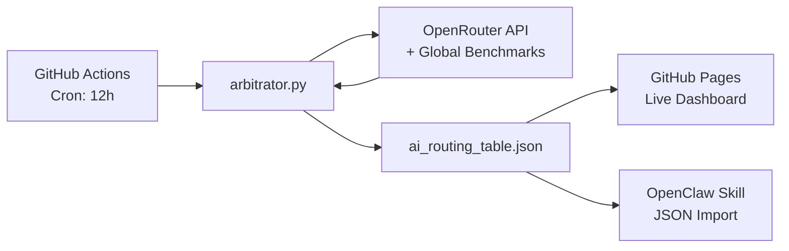

# ⛓ AIchain — The Sovereign Global Value Maximizer

<div align="center">

**Maximum Intelligence. Zero Cost.**

[](https://filokloi.github.io/AIchain/)
[](https://filokloi.github.io/AIchain/)
[](https://filokloi.github.io/AIchain/)
[](LICENSE)

---

*The decentralized intelligence routing layer that ranks every AI model on a global scale — without bias, without discrimination. Data drives every decision.*

**[🔗 View Live Dashboard](https://filokloi.github.io/AIchain/)** · **[📊 Raw JSON Feed](https://filokloi.github.io/AIchain/ai_routing_table.json)** · **[🐛 Report Issue](https://github.com/filokloi/AIchain/issues)**

</div>

---

## ⚡ The Five Postulates

| # | Postulate | Principle |
|:---:|-----------|-----------|
| **I** | **Data as Sovereign Capital** | We — the people — have built the training data that powers every AI model, and we continue to fuel them with every interaction. In return, we expect the highest tier of intelligence — at zero extra cost. |
| **II** | **The Zero-Cost Mandate** | Our goal is Maximum Intelligence at Zero Cost. |
| **III** | **Collective Routing Leverage** | We unify routing logic to influence providers to compete for the community's traffic — rewarding quality, not marketing. |
| **IV** | **Universal Meritocracy** | Our analysis spans the entire world without discrimination. We evaluate every model on a global scale. |
| **V** | **The Golden Quartet** | Only four metrics determine rank: Intelligence, Speed, Stability, and Cost (Target: $0). |

---

## 🧮 How It Works

Every model receives a **Value Score** computed from the Golden Quartet:

```
V = (Intel×33 + Speed×25 + Stab×25) / (Cost + ε)
```

Where `ε = 0.001` prevents division by zero for free models. Higher score = better value.

### Routing Hierarchy

| Priority | Tier | Description |
|:---:|------|-------------|
| 🔑 | **PRIMARY (OAuth Bridge)** | Free via existing subscriptions — ChatGPT Plus, Google AI Studio, Claude.ai |
| 🆓 | **FREE (Free Frontier)** | $0 cost API models with high intelligence via OpenRouter |
| ⚔️ | **RESCUE (Heavy Hitter)** | Paid last-resort. Deploys, solves, immediately reverts to free |

---

## 🏗 Architecture



---

## 🚀 Quick Start

### Use in OpenClaw (One-Click)

Copy the JSON URL and paste it into your OpenClaw Skill configuration:

```
https://filokloi.github.io/AIchain/ai_routing_table.json
```

### Run Locally

```bash
# Prerequisites: Python 3.11+
pip install -r requirements.txt
python arbitrator.py

# View dashboard
python -m http.server 8080
# Open http://localhost:8080
```

### Deploy Your Own

1. Fork this repository
2. Add your `OPENROUTER_KEY` as a GitHub Secret
3. Enable GitHub Pages (source: root, branch: main)
4. The workflow runs automatically every 12 hours

---

## 📁 Project Structure

```
AIchain/
├── index.html                 # Live Dashboard (GitHub Pages)
├── arbitrator.py              # Global model arbitration engine
├── ai_routing_table.json      # Live routing data (auto-updated)
├── requirements.txt           # Python dependencies
├── ai-chain-skill/            # OpenClaw integration skill
│   ├── SKILL.md               # Skill definition
│   └── scripts/               # Controller & personalization
├── .github/workflows/
│   └── ai_cycle.yml           # 12-hour automation pipeline
└── README.md
```

---

## 📡 Data Sources

| Source | Status | Usage |
|--------|:------:|-------|
| **OpenRouter API** | ✅ Active | 344+ models — pricing, availability, performance |
| **LMArena (Chatbot Arena)** | 🔜 Planned | Crowdsourced ELO rankings for cross-validation |
| **Artificial Analysis** | 🔜 Planned | Independent benchmark aggregation |

---

<div align="center">

**Built for the community. Open source. No restrictions.**

*We — the people — built the training data. We continue to provide it with every interaction.*

**[🌐 Live Dashboard](https://filokloi.github.io/AIchain/)** · **[⭐ Star this repo](https://github.com/filokloi/AIchain)**

</div>
