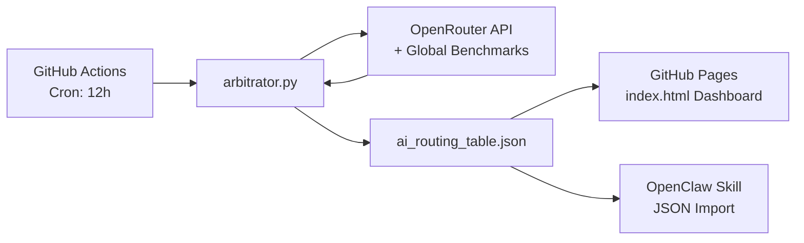

# AIchain — The Sovereign Global Value Maximizer

> *Maximum Intelligence. Zero Cost.*

**AIchain** is the decentralized intelligence routing layer for [OpenClaw](https://github.com/openclaw/openclaw). It acts as a global "Value Maximizer" for AI models — objectively ranking every provider on the planet through the **Golden Quartet** metrics, without bias or discrimination.

---

## The Five Postulates

| # | Postulate | Principle |
|---|-----------|-----------|
| I | **Data as Sovereign Capital** | We provide the "fuel" only if we receive the highest tier of intelligence in return. |
| II | **The Zero-Cost Mandate** | Our goal is Maximum Intelligence at Zero Cost. |
| III | **Collective Routing Leverage** | We unify routing logic to force providers to compete for our traffic. |
| IV | **Universal Meritocracy** | Our analysis spans the entire world without discrimination. |
| V | **The Golden Quartet** | Only four metrics determine rank: Intelligence, Speed, Stability, and Cost (Target: $0). |

---

## Architecture



## Routing Hierarchy

Models are ranked into three priority tiers:

1. **Tier 0 — OAuth Bridges** — Free via subscription (ChatGPT Plus, Google AI Studio, Claude.ai)
2. **Tier 1 — Free Frontier** — $0 cost API models with high intelligence
3. **Tier 2 — Paid Fallback** — Paid API models, ranked by score-to-cost ratio

## Quick Start

### Prerequisites
- Python 3.11+
- An [OpenRouter API key](https://openrouter.ai/keys) (optional — works in demo mode without one)

### Run Locally
```bash
pip install -r requirements.txt
python arbitrator.py
```

### Deploy to GitHub
1. Fork this repository
2. Add your `OPENROUTER_KEY` as a GitHub Secret
3. Enable GitHub Pages (source: root, branch: main)
4. The workflow runs automatically every 12 hours

### Use in OpenClaw
Copy the JSON URL from the dashboard and paste it into your OpenClaw Skill configuration:
```
https://filokloi.github.io/AIchain/ai_routing_table.json
```

---

## Understanding the Rankings

### Value Score Formula

Models are ranked by a composite **Value Score** that balances capability and cost:

```
ValueScore = (Intelligence / (Cost + ε)) × Stability × SpeedFactor
```

- **Intelligence** (1–100): Overall reasoning capability.
- **Cost**: Price per token (USD). Free models have cost 0.
- **Stability**: Reliability score (0–1).
- **SpeedFactor**: Relative speed (higher = faster).
- **ε** (epsilon): Small constant (0.01) preventing division by zero, giving free models a huge advantage.

This formula naturally favors **high-intelligence free models** and penalizes expensive ones.

### Column Reference

| Column | Details |
|--------|---------|
| Model | Provider/model identifier (used in OpenClaw configuration). |
| Tier | OAUTH_BRIDGE (free with subscription), FREE_FRONTIER ($0 API), HEAVY_HITTER (paid rescue). |
| Intel | Intelligence score (1–100). Notable levels: 99 = exceptional, 96–98 = very high, 94–95 = high, 80–93 = good, <80 = moderate. |
| Cost | Approx. cost per million tokens (USD). Free = $0.00. |
| Value | Computed ranking metric; higher is better. |
| Provider | Organization hosting the model. |
| Stability | Reliability (0–1). Higher means more uptime. |
| Speed | Relative latency factor; higher = lower latency. |

### Usage Instructions

1. Install the AIchain skill (run `install.ps1`).
2. The skill fetches `https://filokloi.github.io/AIchain/ai_routing_table.json` automatically.
3. OpenClaw routes queries to the optimal free model.
4. Manual overrides:
   - `--godmode <model>`: force a specific model
   - `--auto`: return to automatic selection
   - `--escalate`: immediately invoke Heavy Hitter
   - `--revert`: go back to free primary

Cron jobs maintain freshness:
- 12-hour global ranking update
- 6-hour health check

For issues, see the [GitHub repo](https://github.com/filokloi/AIchain).

---

## Project Structure

```
AIchain/
├── arbitrator.py              # Global model arbitration engine
├── ai_routing_table.json      # Live routing data (auto-updated)
├── index.html                 # Dashboard (GitHub Pages)
├── requirements.txt           # Python dependencies
├── README.md                  # This file
├── .gitignore
└── .github/
    └── workflows/
        └── ai_cycle.yml       # 12-hour automation pipeline
```

## Commit Discipline (recommended)

This repository uses conventional commit format and lightweight hook guards.

1. Run hook setup once:
```powershell
powershell -ExecutionPolicy Bypass -File .\scripts\setup-hooks.ps1
```
2. Use helper commit command:
```powershell
powershell -ExecutionPolicy Bypass -File .\scripts\commit.ps1 -Type fix -Scope skill -Message "prevent invalid free model selection" -Push
```

## License

Open source. Built for the community. No restrictions.
